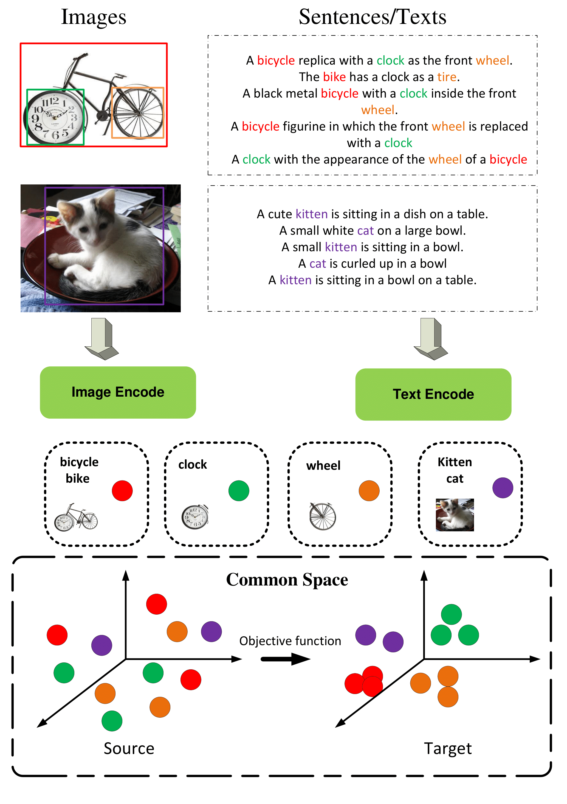
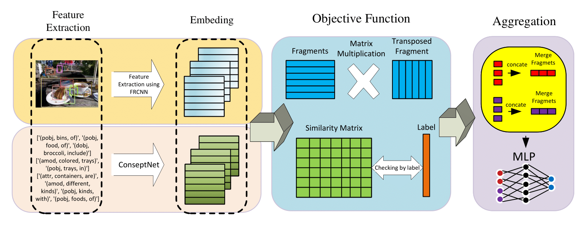

# Cross-Modal Space Learning with MLP Aggregation for Image-Text Matching 🔗🖼️📝



## 🌟 Abstract
In the realm of artificial intelligence, image-text matching remains a pivotal yet challenging task. Traditional methods often struggle to align visual and textual data effectively. This paper introduces **Cross-Modal Space Learning with MLP Aggregation**, a novel approach that embeds images and texts into a unified representation space, enabling the capture of subtle relationships between the two modalities. Key contributions include:  
- **Cross-modal learning** for bridging the semantic gap.
- **MLP-based aggregation** for efficient and precise matching.
- Superior performance on benchmark datasets, significantly improving recall rates.

This research advances multimodal AI by providing a robust framework for accurate and efficient image-text matching.

---

## 🏗️ Architecture Overview


Our proposed model follows these core steps:
1. **Image and Text Embedding**: Map visual and textual data into a unified latent space.
2. **Cross-Modal Aggregation**: Use an MLP-based architecture to bridge the semantic gap between image and text representations.
3. **Recall Optimization**: Leverage an objective function to optimize the matching task, ensuring high recall and efficiency.

---

## 📂 Repository Contents
This repository contains the implementation of our approach, including datasets, pre-processing, training scripts, and evaluation methods.

### 🔥 Firefly Algorithm Folder: `firefly`
- `fa_mincon.m`: MATLAB implementation of the Firefly Algorithm.
- `run_fa_mincon.m`: Script to execute the Firefly Algorithm.

### 📚 Word Embedding
- `Word_Embeding.ipynb`: 
  - Reads image captions.  
  - Utilizes **ConceptNet** and **SpaCy** to extract visual words and their synonyms.  
  - Saves the output in a `.pkl` file.

### 📷 Image Tensor Generation
- `Tensor_of_image.ipynb`: 
  - Loads COCO dataset images.  
  - Utilizes Faster R-CNN to extract and save image tensors.

- `Object_Detection_using_Faster_RCNN_PyTorch.ipynb`: Demonstrates how to select and visualize tensor images.

### 📊 Evaluation and Metrics
- `Recall@K`: Tests image and text tensors, calculates **Recall@K** for performance evaluation.

### 🧰 File Conversion
- `Open mat files.ipynb`: Converts trained weights from MATLAB `.mat` files to `.npy` files.

### 🧠 Model Training and Testing
- `MLP.ipynb`: Implements the MLP architecture for aggregation.  
  - **Train** the model.  
  - **Evaluate** performance.

- `CodeForAll.ipynb`: Combines all components to test the final results.

---

## 🚀 Getting Started
1. **Clone the repository**:
   ```bash
   git clone https://github.com/yourusername/cross-modal-space-learning
   cd cross-modal-space-learning
## ✨ Key Results
- **High Recall@K:** Outperformed baseline methods on standard datasets.
- **Efficient Aggregation:** Reduced computational complexity without sacrificing accuracy.
